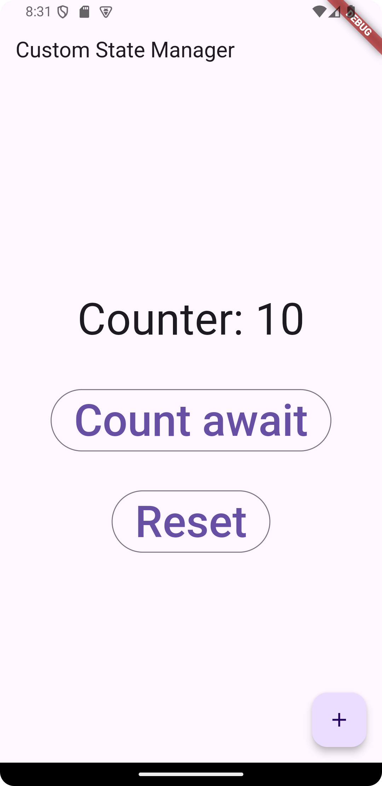

# Flutter State Manager Package

## Giới thiệu

Đây là lộ trình chi tiết để phát triển một package Flutter quản lý state tối ưu, linh hoạt và dễ sử dụng. Package này giúp bạn xây dựng các ứng dụng Flutter với khả năng quản lý state hiệu quả và tích hợp dễ dàng vào UI.

## 1. Cấu trúc và Tổ chức

Thư mục chính của package:

```


FlutterStateManagementPackage/
├── example/
│   ├── lib/
│       └── main.dart
├── test/
│   ├── widget_test.dart
│   └── ...
├── lib/
│   │
│   ├── core/
│   │   └── state_manager.dart   // Logic quản lý state.
│   ├── extensions/
│   │   └── async_state_manager.dart  // Quản lý state bất đòng bộ.
│   ├── widgets/
│   │   ├── state_builder.dart   // Widget để lắng nghe state.
│   │   └── state_provider.dart  // Cung cấp context cho state.
│   └── state_management.dart        // Điểm khởi đầu của package.
│  
├── pubspec.yaml
├── README.md
├── LICENSE
├── CHANGELOG.md
└── analysis_options.yaml


```

Kiến trúc logic:

- Sử dụng mẫu thiết kế **Observable + Observer** để theo dõi state thay đổi và cập nhật UI.
- Tạo một lớp quản lý state chung (**StateManager**) để quản lý state đơn giản, phức tạp hoặc lồng ghép (nested).

## 2. API và Giao diện Sử dụng

### 2.1. State Manager

import 'dart:ui';

/// Core class to manage state
class StateManager<T> {
T _value;
final List<VoidCallback> _listeners = [];

StateManager({required T initialValue}) : _value = initialValue;

/// Get current value
T get value => _value;

/// Update state synchronously
void update(T Function(T currentValue) updater) {
_value = updater(_value);
_notifyListeners();
}

/// Set new value directly
set value(T newValue) {
if (_value != newValue) {
_value = newValue;
_notifyListeners();
}
}

/// Reset state to default
void reset() {
if (_value is num) {
_value = 0 as T;
} else if (_value is String) {
_value = '' as T;
} else if (_value is List || _value is Map) {
_value = [] as T;
}
_notifyListeners();
}

/// Add listener to watch for state changes
void addListener(VoidCallback listener) {
_listeners.add(listener);
}

/// Remove listener
void removeListener(VoidCallback listener) {
_listeners.remove(listener);
}

/// Notify listeners of changes
void _notifyListeners() {
for (var listener in _listeners) {
listener();
}
}
}

```dart
final counterState = StateManager<int>(initialValue: 0);
```

### Khởi tạo State

Cung cấp cách khởi tạo state dễ dàng:

```dart
final counterState = StateManager<int>(initialValue: 0);
```

### 2.2. Cập nhật, Theo dõi và Reset State

- **Cập nhật giá trị:**

```dart
counterState.update((value) => value + 1);
```

- **Theo dõi state thay đổi:**

```dart
counterState.addListener(() {
  print('State changed: ${counterState.value}');
});
```

- **Reset giá trị:**

```dart
counterState.reset();
```

### 2.3. State Builder

```dart
import 'package:flutter/widgets.dart';

import '../core/state_manager.dart';

typedef StateWidgetBuilder<T> = Widget Function(BuildContext context, T value);

/// Widget to rebuild UI based on state changes
class StateBuilder<T> extends StatefulWidget {
  final StateManager<T> state;
  final StateWidgetBuilder<T> builder;

  const StateBuilder({
    Key? key,
    required this.state,
    required this.builder,
  }) : super(key: key);

  @override
  _StateBuilderState<T> createState() => _StateBuilderState<T>();
}

class _StateBuilderState<T> extends State<StateBuilder<T>> {
  late T _currentValue;

  @override
  void initState() {
    super.initState();
    _currentValue = widget.state.value;
    widget.state.addListener(_onStateChanged);
  }

  void _onStateChanged() {
    setState(() {
      _currentValue = widget.state.value;
    });
  }

  @override
  void dispose() {
    widget.state.removeListener(_onStateChanged);
    super.dispose();
  }

  @override
  Widget build(BuildContext context) {
    return widget.builder(context, _currentValue);
  }
}
```
### 2.4. State Provider

```dart
import 'package:flutter/widgets.dart';

import '../core/state_manager.dart';

/// Provides states to the widget tree
class StateProvider extends InheritedWidget {
  final List<StateManager> states;

  const StateProvider({
    Key? key,
    required this.states,
    required Widget child,
  }) : super(key: key, child: child);

  /// Retrieve state from context
  static T of<T>(BuildContext context) {
    final StateProvider? provider =
    context.dependOnInheritedWidgetOfExactType<StateProvider>();
    return provider!.states.firstWhere((s) => s is StateManager<T>) as T;
  }

  @override
  bool updateShouldNotify(covariant StateProvider oldWidget) {
    return oldWidget.states != states;
  }
}

```

### 2.5. Khai báo Package State Management

```dart

library state_management;

// Export the core StateManager
export 'core/state_manager.dart';

// Export StateBuilder for UI integration
export 'widgets/state_builder.dart';

// Export StateProvider for state context management
export 'widgets/state_provider.dart';

// Export the core StateManager
export 'extensions/async_state_manager.dart';

```

### 2.6. Sử dụng với UI

- **Tích hợp State với UI (StateBuilder):**

```dart
StateBuilder<int>(
  state: counterState,
  builder: (context, value) {
    return Text('Counter: $value');
  },
);
```

- **Cung cấp state qua context:**

```dart
StateProvider(
  states: [counterState],
  child: MyApp(),
);
```

## 3. Hiệu suất và Tối ưu hóa

### 3.1. Chỉ cập nhật thành phần liên quan

StateBuilder chỉ render lại khi state liên quan thay đổi:

```dart
if (oldValue != newValue) {
  notifyListeners();
}
```

### 3.2. Đo hiệu suất

- Sử dụng **Stopwatch** để đo thời gian thực thi state updates.
- Tích hợp log để kiểm tra xem package có gây render dư thừa hay không.

## 4. Hỗ trợ Đồng bộ và Bất đồng bộ

### 4.1. State Đồng bộ

Cập nhật đơn giản với `update()`.

### 4.2. State Bất đồng bộ

Cho phép cập nhật state từ các luồng dữ liệu như API:

```dart
Future<void> fetchAndUpdate() async {
  final data = await fetchDataFromAPI();
  counterState.set(data);
}
```

## 5. Ví dụ Sử dụng

Sử dụng package trong ứng dụng Flutter:

```dart
import 'package:flutter/cupertino.dart';
import 'package:flutter/material.dart';
import 'package:state_management/state_management.dart';

final counterState = StateManager<int>(initialValue: 0);

void main() {
  runApp(
    StateProvider(
      states: [counterState],
      child: MyApp(),
    ),
  );
}

class MyApp extends StatelessWidget {
  @override
  Widget build(BuildContext context) {
    return MaterialApp(
      home: CounterScreen(),
    );
  }
}

class CounterScreen extends StatelessWidget {
  @override
  Widget build(BuildContext context) {
    return Scaffold(
      appBar: AppBar(title: Text('Custom State Manager')),
      body: Center(
        child: StateBuilder<int>(
          state: counterState,
          builder: (context, value) {
            return Column(
              mainAxisAlignment: MainAxisAlignment.center,
              children: [
                Text(
                  'Counter: $value',
                  style: TextStyle(fontSize: 45),
                ),
                SizedBox(height: 40),
                OutlinedButton(
                    onPressed: () {
                      fetchAndUpdate();
                    },
                    child: const Text(
                      "Count await",
                      style: TextStyle(fontSize: 45),
                    )),
                SizedBox(height: 40),
                OutlinedButton(
                    onPressed: () {
                      counterState.reset();
                    },
                    child: const Text(
                      "Reset",
                      style: TextStyle(fontSize: 45),
                    ))
              ],
            );
          },
        ),
      ),
      floatingActionButton: FloatingActionButton(
        onPressed: () {
          counterState.update((value) => value + 1);
          fetchAndUpdate();
        },
        child: Icon(Icons.add),
      ),
    );
  }

  Future<void> fetchAndUpdate() async {
    await counterState.updateAsync((value) async {
      await Future.delayed(Duration(seconds: 1));
      return value + 10; // Giả lập fetch dữ liệu
    });
  }
}

```



[//]: # (## 6. Tài liệu)

[//]: # ()
[//]: # (Tài liệu đi kèm cần làm rõ:)

[//]: # ()
[//]: # (- Cách khởi tạo state và tích hợp UI.)

[//]: # (- Mô tả API chính &#40;StateManager, StateBuilder, StateProvider&#41;.)

[//]: # (- Hướng dẫn sử dụng state phức tạp &#40;map, list, hoặc nested&#41;.)

[//]: # ()
[//]: # (## 7. Kiểm thử)

[//]: # ()
[//]: # (Viết test cho các trường hợp:)

[//]: # ()
[//]: # (- State thay đổi giá trị.)

[//]: # (- UI được cập nhật chính xác.)

[//]: # (- Đồng bộ/bất đồng bộ hoạt động đúng.)

[//]: # (- Kiểm tra rò rỉ bộ nhớ và hiệu suất khi có nhiều state.)

[//]: # ()
[//]: # (---)

[//]: # ()
[//]: # (Với cách tiếp cận trên, bạn có thể phát triển một package state manager tối ưu, dễ dùng và linh hoạt cho các ứng dụng Flutter.)
